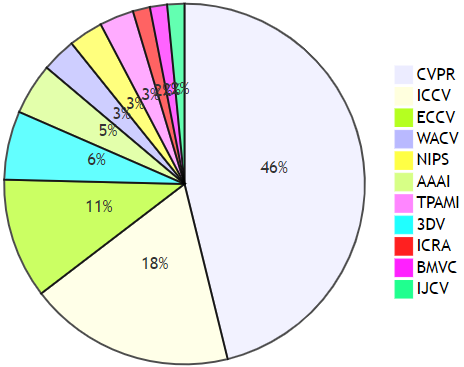
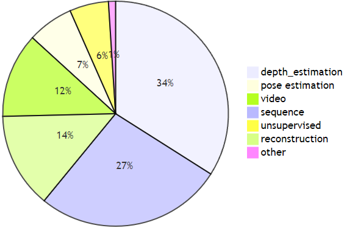

# awesome-monocular-reconstruction [](https://awesome.re)

For anyone who wants to do research about 3D monocular reconstruction.   

If you find the awesome paper/code/dataset or have some suggestions, please feel free to contact linzhuochen@foxmail.com. Thanks for your valuable contribution to the research community :smiley:   

**Last update: 2022-04-12**

<h1> 

```diff
- Recent papers (from 2017)
```

</h1>

<h3> Keywords </h3>

__`dep.`__: depth estimation 

__`pose.`__: pose estimation &emsp; | &emsp; __`video.`__: video 

__`seq.`__: sequence  &emsp; | &emsp; __`uns.`__: unsupervised

__`recon.`__: reconstruction &emsp; | &emsp; __`oth.`__: other

Statistics: :fire: code is available & stars >= 100 &emsp;|&emsp; :star: citation >= 50


<figure class="half">
    
    
</figure>


## 2017
- [[NIPS](https://arxiv.org/pdf/1708.05375.pdf)] Learning a Multi-View Stereo Machine. [__`seq.`__ __`recon.`__]
- [[CVPR](https://openaccess.thecvf.com/content_cvpr_2017/papers/Ummenhofer_DeMoN_Depth_and_CVPR_2017_paper.pdf)] DeMoN: Depth and Motion Network for Learning Monocular Stereo. [[tensorflow](https://github.com/lmb-freiburg/demon)] [__`dep.`__ __`pos.`__ __`seq.`__] :fire: :star:

- [[CVPR](https://openaccess.thecvf.com/content_cvpr_2017/papers/Zhou_Unsupervised_Learning_of_CVPR_2017_paper.pdf)] Unsupervised Learning of Depth and Ego-Motion from Video. [[tensorflow](https://github.com/tinghuiz/SfMLearner)] [__`dep.`__ __`pos.`__ __`seq.`__ __`video.`__ __`uns.`__] :fire: :star:
- [[ICCV](https://openaccess.thecvf.com/content_cvpr_2017/papers/Zhou_Unsupervised_Learning_of_CVPR_2017_paper.pdf)] SurfaceNet: An End-to-end 3D Neural Network for Multiview Stereopsis. [[theano](https://github.com/mjiUST/SurfaceNet)] [__`seq.`__ __`recon.`__] :fire: :star:


---
## 2018
- [[CVPR](https://openaccess.thecvf.com/content_cvpr_2018/papers/Fu_Deep_Ordinal_Regression_CVPR_2018_paper.pdf)] Deep Ordinal Regression Network for Monocular Depth Estimation. [[pytorch](https://github.com/dontLoveBugs/DORN_pytorch)] [__`dep.`__ ] :fire: :star:
- [[CVPR](https://openaccess.thecvf.com/content_cvpr_2018/papers/Xian_Monocular_Relative_Depth_CVPR_2018_paper.pdf)] Monocular Relative Depth Perception with Web Stereo Data Supervision. [[caffe](https://github.com/Huangying-Zhan/Depth-VO-Feat)] [__`dep.`__] :fire: :star:
- [[CVPR](https://openaccess.thecvf.com/content_cvpr_2018/papers/Li_MegaDepth_Learning_Single-View_CVPR_2018_paper.pdf)] MegaDepth: Learning Single-View Depth Prediction from Internet Photos. [[pytorch](https://github.com/zl548/MegaDepth)] [__`dep.`__ ] :fire: :star:
- [[CVPR](https://openaccess.thecvf.com/content_cvpr_2018/papers/Xu_Structured_Attention_Guided_CVPR_2018_paper.pdf)] Structured Attention Guided Convolutional Neural Fields for Monocular Depth Estimation [[caffe](https://github.com/danxuhk/StructuredAttentionDepthEstimation)] [__`dep.`__ ] :fire: :star:

- [[CVPR](https://openaccess.thecvf.com/content_cvpr_2018/papers/Huang_DeepMVS_Learning_Multi-View_CVPR_2018_paper.pdf)] DeepMVS: Learning Multi-view Stereopsis [[pytorch](https://github.com/phuang17/DeepMVS)] [__`dep.`__ __`seq.`__ ] :fire: :star:
- [[ECCV](https://openaccess.thecvf.com/content_ECCV_2018/papers/Yao_Yao_MVSNet_Depth_Inference_ECCV_2018_paper.pdf)] MVSNet: Depth Inference for Unstructured Multi-view Stereo [[pytorch](https://github.com/YoYo000/MVSNet)] [__`dep.`__ __`seq.`__ ] :fire: :star:
- [[3DV](https://arxiv.org/pdf/1807.08563.pdf)] MVDepthNet: Real-time Multiview Depth Estimation Neural Network [[pytorch](https://github.com/HKUST-Aerial-Robotics/MVDepthNet)] [__`dep.`__ __`seq.`__ __`video.`__ ] :fire: :star:
- [[ECCV](https://openaccess.thecvf.com/content_ECCV_2018/papers/Huizhong_Zhou_DeepTAM_Deep_Tracking_ECCV_2018_paper.pdf)] DeepTAM: Deep Tracking and Mapping. [[tensorflow](https://github.com/lmb-freiburg/deeptam)] [__`dep.`__ __`seq.`__ __`video.`__ __`pose.`__] :fire: :star:
- [[ECCV](https://arxiv.org/pdf/1809.02966.pdf)] LS-Net: Learning to Solve Nonlinear Least Squares for Monocular Stereo [__`dep.`__ __`seq.`__ __`video.`__ __`pose.`__] :fire: :star:
- [[CVPR](https://openaccess.thecvf.com/content_cvpr_2018/papers/Zhan_Unsupervised_Learning_of_CVPR_2018_paper.pdf)] Unsupervised Learning of Monocular Depth Estimation and Visual Odometry with Deep Feature Reconstruction. [[caffe](https://github.com/Huangying-Zhan/Depth-VO-Feat)] [__`dep.`__ __`pos.`__ __`seq.`__ __`video.`__ __`uns.`__] :fire: :star:

- [[CVPR](https://openaccess.thecvf.com/content_cvpr_2018/papers/Mahjourian_Unsupervised_Learning_of_CVPR_2018_paper.pdf)] Unsupervised Learning of Depth and Ego-Motion from Monocular Video
Using 3D Geometric Constraints. [[tensorflow](https://sites.google.com/view/vid2depth)] [__`dep.`__ __`pos.`__ __`seq.`__ __`video.`__ __`uns.`__] :fire: :star:

- [[ICRA](http://senwang.gitlab.io/UnDeepVO/files/UnDeepVO.pdf)] UnDeepVO: Monocular Visual Odometry through Unsupervised Deep
Learning. [__`dep.`__ __`pos.`__ __`seq.`__ __`video.`__ __`uns.`__]
- [[CVPR](https://openaccess.thecvf.com/content_cvpr_2018/papers/Yin_GeoNet_Unsupervised_Learning_CVPR_2018_paper.pdf)] GeoNet: Unsupervised Learning of Dense Depth, Optical Flow and Camera Pose. [[tensorflow]https://github.com/yzcjtr/GeoNet)] [__`dep.`__ __`pos.`__ __`seq.`__ __`video.`__ __`uns.`__ __`oth.`__ ]


---
## 2019
- [[Arxiv](https://arxiv.org/pdf/1907.10326v5.pdf)] From Big to Small: Multi-Scale Local Planar Guidance
for Monocular Depth Estimation. [[pytorch+tensorflow](https://github.com/cleinc/bts)] [__`dep.`__ ] :fire: :star:
- [[CVPR](https://openaccess.thecvf.com/content_CVPR_2019/papers/Chen_Learning_Single-Image_Depth_From_Videos_Using_Quality_Assessment_Networks_CVPR_2019_paper.pdf)]Learning Single-Image Depth from Videos using Quality Assessment Networks [[pytorch](https://github.com/princeton-vl/YouTube3D)] [__`dep.`__ ] :fire: :star:
- [[WACV](https://arxiv.org/pdf/1803.08673v2.pdf)] Revisiting Single Image Depth Estimation-Toward Higher Resolution Maps with Accurate Object Boundaries. [[pytorch](https://github.com/JunjH/Revisiting_Single_Depth_Estimation)] [__`dep.`__ ] :fire: :star:
- [[ICCV](https://openaccess.thecvf.com/content_ICCV_2019/papers/Yin_Enforcing_Geometric_Constraints_of_Virtual_Normal_for_Depth_Prediction_ICCV_2019_paper.pdf)] Enforcing geometric constraints of virtual normal for depth prediction. [[pytorch](https://github.com/YvanYin/VNL_Monocular_Depth_Prediction)] [__`dep.`__ ] :fire: :star:
- [[ICCV](https://openaccess.thecvf.com/content_ICCV_2019/papers/Hu_Visualization_of_Convolutional_Neural_Networks_for_Monocular_Depth_Estimation_ICCV_2019_paper.pdf)] Visualization of Convolutional Neural Networks for Monocular Depth Estimation. [[pytorch](https://github.com/JunjH/Visualizing-CNNs-for-monocular-depth-estimation)] [__`dep.`__ ] :fire: :star:
- [[ICLR](https://arxiv.org/pdf/1905.00538v1.pdf)] DPSNet: End-to-end Deep Plane Sweep Stereo. [[pytorch](https://github.com/sunghoonim/DPSNet)] [__`dep.`__ __`seq.`__] :fire: :star:
- [[CVPR](https://openaccess.thecvf.com/content_CVPR_2019/papers/Liu_Neural_RGBrD_Sensing_Depth_and_Uncertainty_From_a_Video_Camera_CVPR_2019_paper.pdf)] Neural RGB→D Sensing: Depth and Uncertainty from a Video Camera. [[pytorch](https://github.com/NVlabs/neuralrgbd)] [__`dep.`__ __`seq.`__ __`video.`__] :fire: :star:
- [[3DV](https://arxiv.org/pdf/1904.11112.pdf)] Web Stereo Video Supervision for Depth Prediction from Dynamic Scenes. [[pytorch](https://github.com/MightyChaos/wsvd_test)] [[__`dep.`__ __`seq.`__ __`video.`__ ] :fire: :star:
- [[CVPR](https://openaccess.thecvf.com/content_CVPR_2019/papers/Yao_Recurrent_MVSNet_for_High-Resolution_Multi-View_Stereo_Depth_Inference_CVPR_2019_paper.pdf)] Recurrent MVSNet for High-resolution Multi-view Stereo Depth Inference. [[tensorflow](https://github.com/YoYo000/MVSNet)] [[__`dep.`__ __`seq.`__ __`recon.`__ ] :fire: :star:
- [[ICCV](https://openaccess.thecvf.com/content_ICCV_2019/papers/Chen_Point-Based_Multi-View_Stereo_Network_ICCV_2019_paper.pdf)] Point-Based Multi-View Stereo Network. [[pytorch](https://github.com/callmeray/PointMVSNet)] [[__`dep.`__ __`seq.`__ __`recon.`__ ] :fire: :star:
- [[ICCV](https://openaccess.thecvf.com/content_ICCV_2019/papers/Luo_P-MVSNet_Learning_Patch-Wise_Matching_Confidence_Aggregation_for_Multi-View_Stereo_ICCV_2019_paper.pdf)] P-MVSNet: Learning Patch-wise Matching Confidence Aggregation for Multi-view Stereo. [[__`dep.`__ __`seq.`__ __`recon.`__ ]
- [[ICCV](https://openaccess.thecvf.com/content_ICCV_2019/papers/Xue_MVSCRF_Learning_Multi-View_Stereo_With_Conditional_Random_Fields_ICCV_2019_paper.pdf)] MVSCRF: Learning Multi-view Stereo with Conditional Random Fields. [__`dep.`__ __`seq.`__ __`recon.`__ ] 

- [[ICLR](https://arxiv.org/pdf/1806.04807.pdf)] BA-Net: Dense Bundle Adjustment Network. [[tensorflow](https://github.com/frobelbest/BANet)] [__`dep.`__ __`seq.`__ __`video.`__ __`pose.`__] :fire: :star:
- [[AAAI](https://arxiv.org/pdf/1811.06152.pdf)] Depth Prediction without the Sensors: Leveraging Structure for Unsupervised Learning from Monocular Videos. [[tensorflow](https://github.com/tensorflow/models/tree/archive/research/struct2depth)] [__`dep.`__ __`seq.`__ __`video.`__ __`pose.`__ __`uns.`__] :fire: :star:
- [[ICCV](https://arxiv.org/pdf/1806.01260.pdf)] Digging Into Self-Supervised Monocular Depth Estimation. [[pytorch](https://github.com/nianticlabs/monodepth2)] [__`dep.`__ __`seq.`__ __`video.`__ __`pose.`__ __`uns.`__] :fire: :star:
- [[ICCV](https://openaccess.thecvf.com/content_ICCV_2019/papers/Sheng_Unsupervised_Collaborative_Learning_of_Keyframe_Detection_and_Visual_Odometry_Towards_ICCV_2019_paper.pdf)] Unsupervised Collaborative Learning of Keyframe Detection and Visual Odometry Towards Monocular Deep SLAM. [__`dep.`__ __`seq.`__ __`video.`__ __`pose.`__ __`uns.`__]

- [[ICCV](https://openaccess.thecvf.com/content_ICCV_2019/papers/Chen_Self-Supervised_Learning_With_Geometric_Constraints_in_Monocular_Video_Connecting_Flow_ICCV_2019_paper.pdf)] Self-supervised Learning with Geometric Constraints in Monocular Video
Connecting Flow, Depth, and Camera. [__`dep.`__ __`seq.`__ __`video.`__ __`pose.`__ __`uns.`__ __`oth.`__]
- [[ICCV](https://openaccess.thecvf.com/content_CVPR_2019/papers/Ranjan_Competitive_Collaboration_Joint_Unsupervised_Learning_of_Depth_Camera_Motion_Optical_CVPR_2019_paper.pdf)] Competitive Collaboration: Joint Unsupervised Learning of Depth, Camera
Motion, Optical Flow and Motion Segmentation. [[pytorch](https://github.com/anuragranj/cc)][__`dep.`__ __`seq.`__ __`video.`__ __`pose.`__ __`uns.`__ __`oth.`__]


---
## 2020
- [[Arxiv](https://arxiv.org/pdf/2002.00569.pdf)] DiverseDepth: Affine-invariant Depth Prediction Using Diverse Data. [[pytorch](https://github.com/YvanYin/DiverseDepth)] [__`dep.`__ ] :fire: :star:
- [[CVPR](https://openaccess.thecvf.com/content_CVPR_2020/papers/Xian_Structure-Guided_Ranking_Loss_for_Single_Image_Depth_Prediction_CVPR_2020_paper.pdf)] Structure-Guided Ranking Loss for Single Image Depth Prediction [[pytorch](https://github.com/KexianHust/Structure-Guided-Ranking-Loss)] [__`dep.`__] :fire: :star:
- [[TPAMI](https://arxiv.org/pdf/1907.01341v2.pdf)] Towards Robust Monocular Depth Estimation: Mixing Datasets for Zero-shot Cross-dataset Transfer[[pytorch](https://github.com/isl-org/MiDaS)] [__`dep.`__ ] :fire: :star:
- [[CVPR](https://openaccess.thecvf.com/content_CVPR_2020/papers/Kusupati_Normal_Assisted_Stereo_Depth_Estimation_CVPR_2020_paper.pdf)] Normal Assisted Stereo Depth Estimation[[pytorch](https://github.com/udaykusupati/Normal-Assisted-Stereo)] [__`dep.`__ __`seq.`__] :fire: :star:
- [[ECCV](https://www.ecva.net/papers/eccv_2020/papers_ECCV/papers/123540613.pdf)] Occlusion-Aware Depth Estimation with Adaptive Normal Constraints. [__`dep.`__ __`seq.`__ __`video.`__]
- [[TOG](https://arxiv.org/pdf/2004.15021.pdf)] Consistent Video Depth Estimation. [__`dep.`__ __`seq.`__ __`video.`__]
- [[AAAI](https://arxiv.org/pdf/1912.11746.pdf)] Learning Inverse Depth Regression for Multi-View Stereo with Correlation Cost Volume [[code](https://github.com/GhiXu/CIDER)] [__`dep.`__ __`seq.`__ __`recon.`__ ] 
- [[CVPR](https://openaccess.thecvf.com/content_CVPR_2020/papers/Gu_Cascade_Cost_Volume_for_High-Resolution_Multi-View_Stereo_and_Stereo_Matching_CVPR_2020_paper.pdf)] Cascade Cost Volume for High-Resolutoin Multi-View Stereo and Stereo Matching [[pytorch](https://github.com/alibaba/cascade-stereo)] [__`dep.`__ __`seq.`__ __`recon.`__ ] 
- [[CVPR](https://openaccess.thecvf.com/content_CVPR_2020/papers/Cheng_Deep_Stereo_Using_Adaptive_Thin_Volume_Representation_With_Uncertainty_Awareness_CVPR_2020_paper.pdf)] Deep Stereo using Adaptive Thin Volume Representation with Uncertainty Awareness. [[pytorch](https://github.com/touristCheng/UCSNet)] [__`dep.`__ __`seq.`__ __`recon.`__ ] 
- [[CVPR](https://openaccess.thecvf.com/content_CVPR_2020/papers/Yang_Cost_Volume_Pyramid_Based_Depth_Inference_for_Multi-View_Stereo_CVPR_2020_paper.pdf)] Cost Volume Pyramid Based Depth Inference for Multi-View Stereo. [[pytorch](https://github.com/JiayuYANG/CVP-MVSNet)] [__`dep.`__ __`seq.`__ __`recon.`__ ] 
- [[CVPR](https://openaccess.thecvf.com/content_CVPR_2020/papers/Yu_Fast-MVSNet_Sparse-to-Dense_Multi-View_Stereo_With_Learned_Propagation_and_Gauss-Newton_Refinement_CVPR_2020_paper.pdf)] Fast-MVSNet: Sparse-to-Dense Multi-View Stereo with Learned Propagation and Gauss-Newton Refinement. [[pytorch](https://github.com/svip-lab/FastMVSNet)] [__`dep.`__ __`seq.`__ __`recon.`__ ] 
- [[CVPR](https://openaccess.thecvf.com/content_CVPR_2020/papers/Luo_Attention-Aware_Multi-View_Stereo_CVPR_2020_paper.pdf)] Attention-Aware Multi-View Stereo. [__`dep.`__ __`seq.`__ __`recon.`__ ] 
- [[CVPR](https://openaccess.thecvf.com/content_CVPR_2020/papers/Liu_A_Novel_Recurrent_Encoder-Decoder_Structure_for_Large-Scale_Multi-View_Stereo_Reconstruction_CVPR_2020_paper.pdf)] A Novel Recurrent Encoder-Decoder Structure for Large-Scale Multi-view Stereo Reconstruction from An Open Aerial Dataset. [[tensorflow](https://github.com/gpcv-liujin/REDNet)] [__`dep.`__ __`seq.`__ __`recon.`__ ] 
- [[ECCV](https://www.ecva.net/papers/eccv_2020/papers_ECCV/papers/123540732.pdf)] Pyramid Multi-view Stereo Net with Self-adaptive View aggregation. [[pytorch](https://github.com/yhw-yhw/PVAMVSNet)] [__`dep.`__ __`seq.`__ __`recon.`__ ] 
- [[ECCV](https://arxiv.org/pdf/2007.10872v1.pdf)] Dense Hybird Recurrent Multi-view Stereo Net with Dynamic Consistency Checking. [[pytorch](https://github.com/yhw-yhw/D2HC-RMVSNet)] [__`dep.`__ __`seq.`__ __`recon.`__ ] 
- [[BMVC](https://arxiv.org/pdf/2008.07928.pdf)] Visibility-aware Multi-view Stereo Network. [[pytorch](https://github.com/jzhangbs/Vis-MVSNet)] [__`dep.`__ __`seq.`__ __`recon.`__ ] 
- [[ICLR](https://arxiv.org/pdf/1812.04605.pdf)] DeepV2D: Video to Depth with Differentiable Structure From Motion[[tensorflow](https://github.com/princeton-vl/DeepV2D)] [__`dep.`__ __`seq.`__ __`video.`__ __`pose.`__] :fire: :star:

- [[CVPR](https://openaccess.thecvf.com/content_CVPR_2020/papers/Guizilini_3D_Packing_for_Self-Supervised_Monocular_Depth_Estimation_CVPR_2020_paper.pdf)] 3D Packing for Self-Supervised Monocular Depth Estimation [[tensorflow](https://github.com/TRI-ML/packnet-sfm)] [__`dep.`__ __`seq.`__ __`video.`__ __`pose.`__ __`uns.`__] :fire: :star:
- [[CVPR](https://openaccess.thecvf.com/content_CVPR_2020/papers/Yang_D3VO_Deep_Depth_Deep_Pose_and_Deep_Uncertainty_for_Monocular_CVPR_2020_paper.pdf)] D3VO: Deep Depth, Deep Pose and Deep Uncertainty for Monocular Visual Odometry [[tensorflow](https://github.com/TRI-ML/packnet-sfm)] [__`dep.`__ __`seq.`__ __`video.`__ __`pose.`__ __`uns.`__] :fire: :star:
- [[ECCV](https://arxiv.org/pdf/2007.10983.pdf)] Learning Monocular Visual Odometry via Self-Supervised Long-Term Modeling. [__`dep.`__ __`seq.`__ __`video.`__ __`pose.`__ __`uns.`__]


---
## 2021
- [[AAAI](https://ojs.aaai.org/index.php/AAAI/article/view/16282)] Patch-Wise Attention Network for Monocular Depth Estimation.  [__`dep.`__ ]
- [[TPAMI](https://arxiv.org/pdf/2103.04216.pdf)] Virtual Normal: Enforcing Geometric Constraints for Accurate and Robust Depth Prediction[[pytorch](https://github.com/YvanYin/VNL_Monocular_Depth_Prediction)] [__`dep.`__ ] :fire: :star:
- [[CVPR](https://openaccess.thecvf.com/content/CVPR2021/papers/Bhat_AdaBins_Depth_Estimation_Using_Adaptive_Bins_CVPR_2021_paper.pdf)] AdaBins: Depth Estimation Using Adaptive Bins [[pytorch](https://github.com/shariqfarooq123/AdaBins)] [__`dep.`__ ] :fire: :star:
- [[CVPR](https://arxiv.org/pdf/2202.01470.pdf)] Boosting Monocular Depth Estimation with Sparse Guided Points [[pytorch](https://github.com/aim-uofa/AdelaiDepth)] [__`dep.`__ ] :fire: :star:
- [[CVPR](https://openaccess.thecvf.com/content/CVPR2021/papers/Yin_Learning_To_Recover_3D_Scene_Shape_From_a_Single_Image_CVPR_2021_paper.pdf)] Learning to Recover 3D Scene Shape from a Single Image. [[pytorch](https://github.com/aim-uofa/AdelaiDepth)] [__`dep.`__  __`recon.`__] :fire: :star:
- [[ICCV](https://openaccess.thecvf.com/content/ICCV2021/papers/Ranftl_Vision_Transformers_for_Dense_Prediction_ICCV_2021_paper.pdf)] Vision Transformers for Dense Prediction [[pytorch](https://github.com/isl-org/DPT)] [__`dep.`__  __`oth.`__] :fire: :star:
- [[CVPR](https://openaccess.thecvf.com/content/CVPR2021/papers/Kopf_Robust_Consistent_Video_Depth_Estimation_CVPR_2021_paper.pdf)] Robust Consistent Video Depth Estimation.[[pytorch](https://github.com/facebookresearch/robust_cvd)] [__`dep.`__  __`seq.`__ __`video.`__] :fire: :star:

- [[CVPR](https://arxiv.org/pdf/2104.00681.pdf)] NeuralRecon: Real-Time Coherent 3D Reconstruction from Monocular Video. [[pytorch](https://github.com/zju3dv/NeuralRecon)] [__`seq.`__ __`video.`__ __`recon.`__] :fire: :star:
- [[3DV](https://arxiv.org/pdf/2112.00236.pdf)] VoRTX: Volumetric 3D Reconstruction With Transformers for Voxelwise View Selection and Fusion. [[pytorch](https://github.com/noahstier/vortx)] [__`seq.`__ __`video.`__  __`recon.`__] :fire: :star:
- [[WACV](https://openaccess.thecvf.com/content/WACV2021/papers/Zhang_Long-Range_Attention_Network_for_Multi-View_Stereo_WACV_2021_paper.pdf)]Long-range Attention Network for Multi-View Stereo. [__`dep.`__ __`seq.`__ __`recon.`__ ] 
- [[CVPR](https://arxiv.org/pdf/2012.01411.pdf)] PatchmatchNet: Learned Multi-View Patchmatch Stereo [[pytorch](https://github.com/FangjinhuaWang/PatchmatchNet)] [__`dep.`__ __`seq.`__ __`recon.`__ ]  :fire: :star:
- [[ICCV](https://openaccess.thecvf.com/content/ICCV2021/papers/Wei_AA-RMVSNet_Adaptive_Aggregation_Recurrent_Multi-View_Stereo_Network_ICCV_2021_paper.pdf)] AA-RMVSNet: Adaptive Aggregation Recurrent Multi-view Stereo Network [[pytorch](https://github.com/QT-Zhu/AA-RMVSNet)] [__`dep.`__ __`seq.`__ __`recon.`__ ]  :fire: :star:
- [[ICCV](https://openaccess.thecvf.com/content/ICCV2021/papers/Ma_EPP-MVSNet_Epipolar-Assembling_Based_Depth_Prediction_for_Multi-View_Stereo_ICCV_2021_paper.pdf)] EPP-MVSNet: Epipolar-Assembling Based Depth Prediction for Multi-View Stereo [[404](https://gitee.com/mindspore/mindspore/tree/master/model_zoo/research/cv/eppmvsnet)] [__`dep.`__ __`seq.`__ __`recon.`__ ]  :fire: :star:
- [[ICCV](https://openaccess.thecvf.com/content/ICCV2021/papers/Kim_Just_a_Few_Points_Are_All_You_Need_for_Multi-View_ICCV_2021_paper.pdf)] Just a Few Points are All You Need for Multi-view Stereo: A Novel Semi-supervised Learning Method for Multi-view Stereo. [__`dep.`__ __`seq.`__ __`recon.`__ ] 
- [[3DV](https://arxiv.org/pdf/2104.15119v2.pdf)] Deep Multi-View Stereo gone wild. [[pytorch](https://github.com/fdarmon/wild_deep_mvs)] [__`dep.`__ __`seq.`__ __`recon.`__ ] 
- [[IJCV](https://jwbian.net/Papers/SC_Depth_IJCV_21.pdf)] Unsupervised Scale-consistent Depth Learning from Video. [[pytorch](https://github.com/JiawangBian/SC-SfMLearner-Release)] [__`dep.`__ __`seq.`__ __`video.`__ __`pose.`__ __`uns.`__] :fire: :star:
- [[NIPS](https://papers.nips.cc/paper/2021/file/89fcd07f20b6785b92134bd6c1d0fa42-Paper.pdf)] DROID-SLAM: Deep Visual SLAM for Monocular, Stereo, and RGB-D Cameras. [[pytorch](https://github.com/aim-uofa/AdelaiDepth)] [__`dep.`__ __`seq.`__ __`video.`__ __`pose.`__ __`oth.`__]  :fire: :star:
- [[CVPR](https://openaccess.thecvf.com/content/CVPR2021/papers/Wang_Deep_Two-View_Structure-From-Motion_Revisited_CVPR_2021_paper.pdf)] Deep Two-View Structure-from-Motion Revisited. [__`dep.`__ __`seq.`__ __`video.`__ __`pose.`__ __`oth.`__]  :fire: :star:

- [[CVPR](https://openaccess.thecvf.com/content/CVPR2021/papers/Zhang_Holistic_3D_Scene_Understanding_From_a_Single_Image_With_Implicit_CVPR_2021_paper.pdf)] Holistic 3D Scene Understanding from a Single Image with Implicit Representation [ __`recon.`__ __`oth.`__]  :fire: :star: 

- [[CVPR](https://openaccess.thecvf.com/content/CVPR2021/papers/Engelmann_From_Points_to_Multi-Object_3D_Reconstruction_CVPR_2021_paper.pdf)]  From Points to Multi-Object 3D Reconstruction [ __`recon.`__ __`oth.`__]

- [[CVPR](https://openaccess.thecvf.com/content/CVPR2021/papers/Yang_LASR_Learning_Articulated_Shape_Reconstruction_From_a_Monocular_Video_CVPR_2021_paper.pdf)] LASR: Learning Articulated Shape Reconstruction from a Monocular Video [ __`recon.`__ __`video.`__] :fire: :star: 

---
## 2022
- [[CVPR](https://arxiv.org/pdf/2112.02338.pdf)] Generalized Binary Search Network for Highly-Efficient Multi-View Stereo. [[code](https://github.com/MiZhenxing/GBi-Net)]  [__`dep.`__ __`seq.`__ __`recon.`__ ] 
- [[CVPR](https://arxiv.org/pdf/2201.01501.pdf)] Rethinking Depth Estimation for Multi-View Stereo: A Unified Representation and Focal Loss . [__`dep.`__ __`seq.`__ __`recon.`__ ] 

- [[CVPR](https://arxiv.org/pdf/2112.02306.pdf)] Toward Practical Self-Supervised Monocular Indoor Depth Estimation  [__`dep.`__ __`seq.`__ __`video.`__ __`pose.`__ __`uns.`__]


